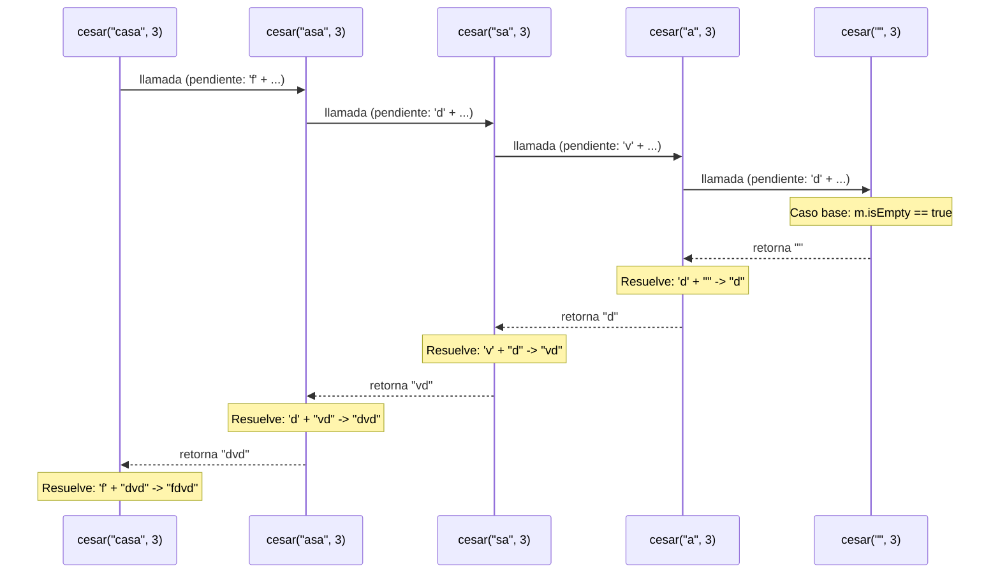
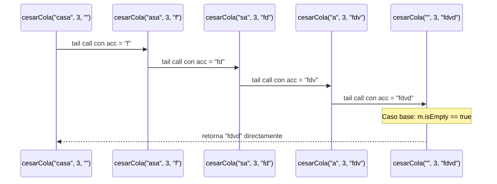

# Informe de Proceso: Cifrado César (Recursión Lineal vs. Recursión de Cola)

Fundamentos de Programación Funcional y Concurrente  
Escuela de Ingeniería de Sistemas y Computación, Universidad del Valle  

---

## 1. Definición de los Algoritmos

El cifrado César desplaza cada letra minúscula $k$ posiciones en módulo 26, copiando los demás caracteres sin cambios.

### 1.1. César con Recursión Lineal (`cesar`)

```scala
def cifrarChar(c: Char, k: Int): Char = {
  if (esMinuscula(c)) {
    val nuevaPosicion = Math.floorMod(c - 'a' + k, 26)
    ('a' + nuevaPosicion).toChar
  } else {
    c
  }
}

def cesar(m: Mensaje, k: Int): Mensaje = {
  if (m.isEmpty) {
    ""
  } else {
    cifrarChar(m.head, k).toString + cesar(m.tail, k)
  }
}
```

* Cada llamada procesa `m.head` y deja la concatenación `+` **pendiente en la pila** esperando el resultado de `cesar(m.tail, k)`.
* Genera un marco de pila por cada letra ($O(n)$ en memoria).

### 1.2. César con Recursión de Cola (`cesarCola`)

```scala
@annotation.tailrec
final def cesarCola(m: Mensaje, k: Int, acc: Mensaje = ""): Mensaje = {
  if (m.isEmpty) acc
  else {
    cesarCola(m.tail, k, acc + cifrarChar(m.head, k))
  }
}
```

* El resultado se construye de izquierda a derecha en el acumulador `acc`.
* La llamada recursiva es la última instrucción (*posición de cola*). Con `@tailrec`, Scala reutiliza el mismo marco de pila ($O(1)$ en memoria).

---

## 2. Traza de `cesar("casa", 3)` (Recursión Lineal)

Para el mensaje `"casa"` con clave $k = 3$:

### 2.1. Crecimiento de la Pila (Apilado de Llamadas)

En cada llamada recursiva se apila un nuevo marco de ejecución (*frame*) en la memoria, dejando la concatenación pendiente mientras el mensaje se reduce:

1. **Llamada 1:** `cesar("casa", 3)` $\to$ Cifra `'c'` a `'f'`. Queda pendiente: `'f' +: cesar("asa", 3)` (1 marco).
2. **Llamada 2:** `cesar("asa", 3)` $\to$ Cifra `'a'` a `'d'`. Queda pendiente: `'d' +: cesar("sa", 3)` (2 marcos).
3. **Llamada 3:** `cesar("sa", 3)` $\to$ Cifra `'s'` a `'v'`. Queda pendiente: `'v' +: cesar("a", 3)` (3 marcos).
4. **Llamada 4:** `cesar("a", 3)` $\to$ Cifra `'a'` a `'d'`. Queda pendiente: `'d' +: cesar("", 3)` (4 marcos).
5. **Caso base:** `cesar("", 3)` $\to$ Condición `m.isEmpty` es `true`, retorna `""` (profundidad máxima de 5 marcos).

### 2.2. Reducción de la Pila (Resolución de Pendientes)

Al alcanzar el caso base, las operaciones pendientes se resuelven en orden inverso:
`""` $\to$ `'d' + ""` = `"d"` $\to$ `'v' + "d"` = `"vd"` $\to$ `'d' + "vd"` = `"dvd"` $\to$ `'f' + "dvd"` = `"fdvd"`.

### 2.3. Diagrama de Secuencia: Pila Lineal



---

## 3. Traza de `cesarCola("casa", 3, "")` (Recursión de Cola)

### 3.1. Evolución del Acumulador

En cada iteración el acumulador `acc` recibe la letra cifrada y no quedan operaciones pendientes:

* **Paso 0:** `cesarCola("casa", 3, "")` $\to$ Cifra `'c'`, nuevo acumulador `acc = "f"`.
* **Paso 1:** `cesarCola("asa", 3, "f")` $\to$ Cifra `'a'`, nuevo acumulador `acc = "fd"`.
* **Paso 2:** `cesarCola("sa", 3, "fd")` $\to$ Cifra `'s'`, nuevo acumulador `acc = "fdv"`.
* **Paso 3:** `cesarCola("a", 3, "fdv")` $\to$ Cifra `'a'`, nuevo acumulador `acc = "fdvd"`.
* **Paso 4 (Caso base):** `cesarCola("", 3, "fdvd")` $\to$ `m.isEmpty` es `true`, retorna `acc = "fdvd"` directamente.

### 3.2. Diagrama de Secuencia: Pila de Cola


